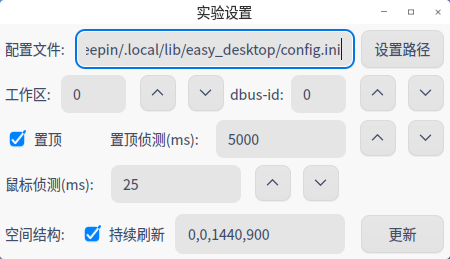
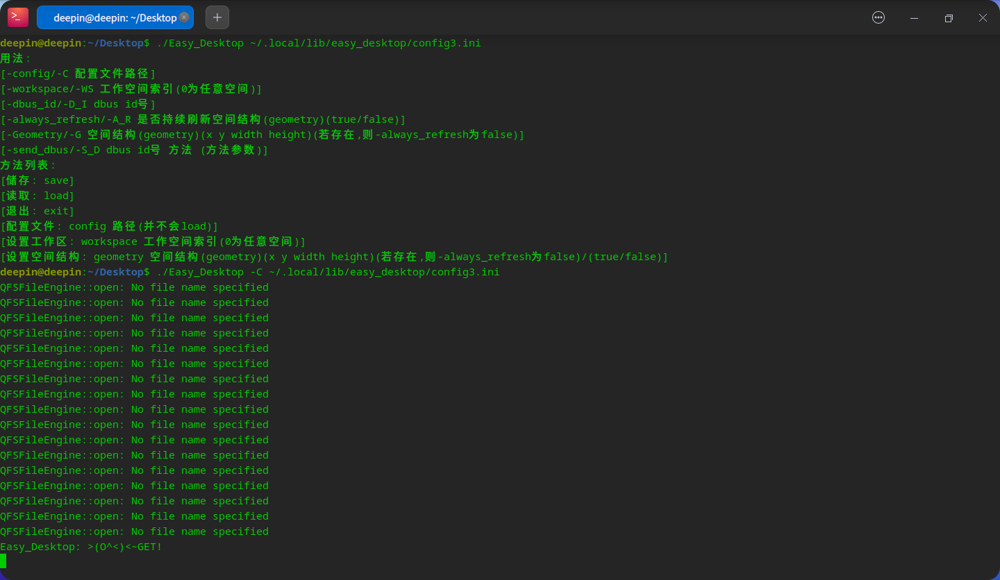
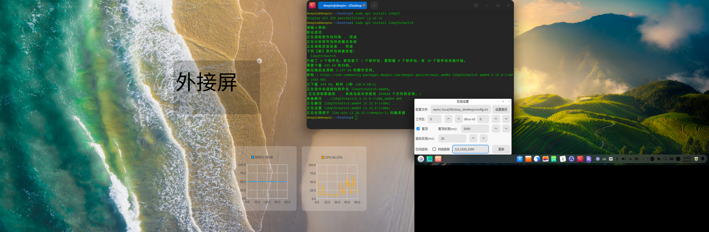

# Easy_Desktop
一个非常规桌面

## 开发环境
qt5.15.8

该软件依赖X11环境(窗口抬升,嵌入窗口,壁纸鼠标效果需要调用X11的函数)
## 结构
desktop_background.h/.cpp : 壁纸显示(图片为QLabel,视频为QGraphicsView)

setting_widget.h/.cpp : 壁纸设置

desktop_main.h/.cpp : 控件显示与总控制

keyscan.h/.cpp : 实现鼠标效果

media_widgetaction.h/.cpp : 控制壁纸声音,速率

all_control.h/.cpp : 统一窗口

core文件夹 : 控件类

控件类继承 core/basic_widget.h/.cpp

widget_control.hpp仅为了方便管理,无特殊效果

"储存"与"读取"是手动的,不是自动的
## 控件
1.时钟

2.文本框(以html格式储存)

3.标签

4.进程按钮

5.文件按钮

6.进程/文件按钮载体

7.内嵌窗口(仍有很多缺陷,但我无法解决)
## 截图

## 演示
演示视频:[bilibili](https://www.bilibili.com/video/BV1eUpfzPEHf/)
## 储存
储存路径: ~/.local/lib/easy_desktop/config.ini

# 26.1.3更新
## 新控件
CPU,内存,网络,磁盘,声音服务对应的可视化图标 //(要对 空指针,爆列表 敏锐点)

"内存"中RAM和SWap是分开的

若在"网络" "磁盘"中使用非等差轴,请注意单位

由于"声音服务"需要连续密集侦测,故耗能较高
## 窗口
新增"实验设置"窗口

注:除"置顶" "置顶侦测" "鼠标侦测"之外的数据不会存储到config中,可用运行参数对其设置

## 运行参数
可以使用终端控制Easy_Desktop

如: ./Easy_Desktop -C ./config.ini 可使./config.ini作为./Easy_Desktop的配置文件

## 其他
1.对进程按钮增加hover效果

2.允许批量导入图像,视频作为壁纸

3.对于多屏幕可以通过修改空间结构(geometry)的方式得到如下效果

4.通过设置工作区可使得Easy_Desktop仅在某工作区显示(0为所有工作区)

5.依靠dbus,只要知道某个Easy_Desktop的dbus_id,便可以控制他
## 依赖
运行需要依赖 libqt5charts5

安装: sudo apt install libqt5charts5
## 未解决的问题
不知道什么原因,当运行参数(argv[i])为"-geometry"时,会判定该参数与下一参数结合(如 -geometry 0 0 0 0被分解成-geometry 0, 0, 0, 0)

这会导致跳转到最后一个else分支,但用"-Geometry"能正常工作

但用纯C++写两个都能过(编译命令:g++ app.cpp)
## 链接
项目地址:[https://github.com/3084793958/Easy_Desktop](https://github.com/3084793958/Easy_Desktop)

前传: [https://bbs.deepin.org/post/291712](https://bbs.deepin.org/post/291712)