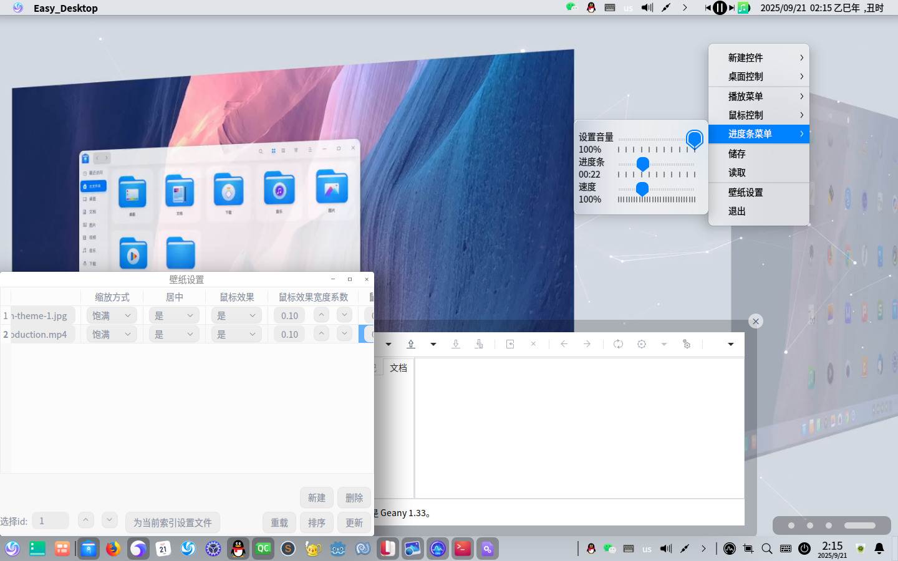

# Easy_Desktop
一个非常规桌面

## 开发环境
qt5.15.8

该软件依赖X11环境(窗口抬升,嵌入窗口,壁纸鼠标效果需要调用X11的函数)
## 结构
desktop_background.h/.cpp : 壁纸显示(图片为QLabel,视频为QGraphicsView)

setting_widget.h/.cpp : 壁纸设置

desktop_main.h/.cpp : 控件显示与总控制

keyscan.h/.cpp : 实现鼠标效果

media_widgetaction.h/.cpp : 控制壁纸声音,速率

all_control.h/.cpp : 统一窗口

core文件夹 : 控件类

控件类继承 core/basic_widget.h/.cpp

widget_control.hpp仅为了方便管理,无特殊效果

"储存"与"读取"是手动的,不是自动的
## 控件
1.时钟

2.文本框(以html格式储存)

3.标签

4.进程按钮

5.文件按钮

6.进程/文件按钮载体

7.内嵌窗口(仍有很多缺陷,但我无法解决)
## 截图

## 储存
储存路径: ~/.local/lib/easy_desktop/config.ini