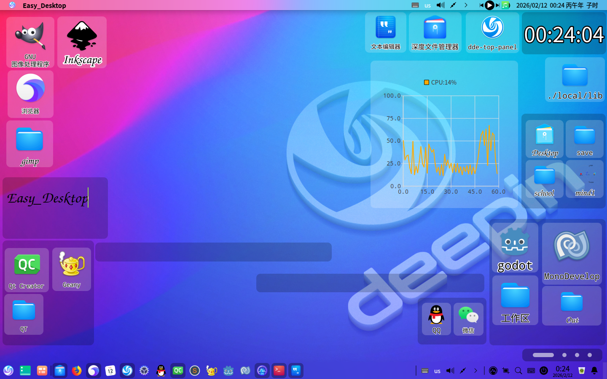
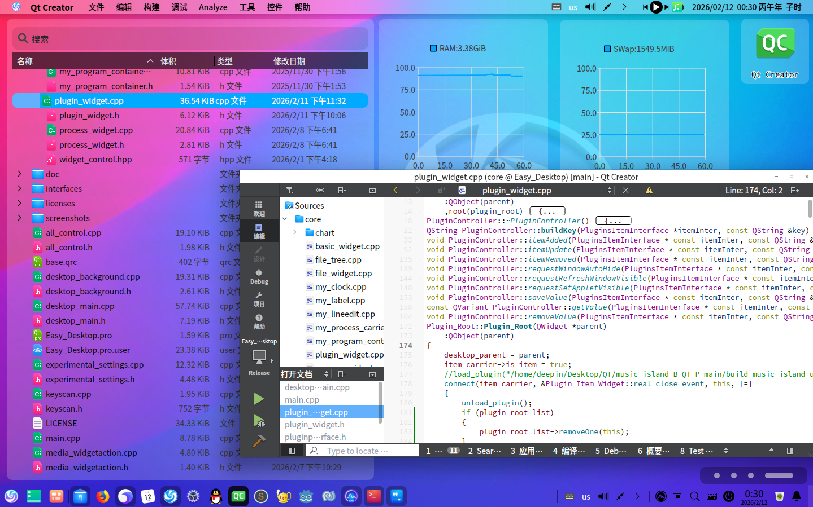
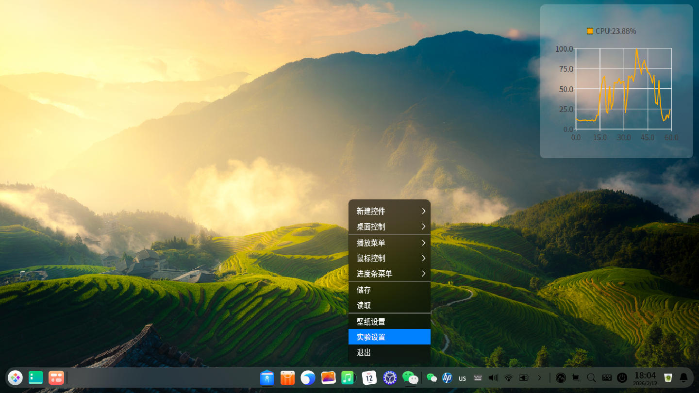

# Easy_Desktop
一个非常规桌面

## 软件截图







## 安装方法

1.安装依赖

tips:Easy_Desktop运行依赖libqt5charts5

安装依赖指令:

```
sudo apt install libqt5charts5
```

2.安装本体

[https://github.com/3084793958/Easy_Desktop/releases/download/26.2.19/Easy_Desktop](https://github.com/3084793958/Easy_Desktop/releases/download/26.2.19/Easy_Desktop)

记得储存,Easy_Desktop不会帮你储存(/tmp那个是用来备份的)

## 命令行控制服务

| 选项/方法 | 描述 |
|-----------|------|
| **命令行选项** | |
| `-config, -C <路径>` | 指定配置文件路径 |
| `-workspace, -WS <索引号>` | 设置工作空间索引 (0 表示任意空间) |
| `-dbus_id, -D_I <ID>` | 设置 dbus_id 号 |
| `-always_refresh, -A_R <布尔值>` | 是否持续刷新空间结构 (true/false) |
| `-Geometry, -G <x y width height>` | 设置空间结构 (设置后 `-always_refresh` 自动为 false) |
| `-send_dbus, -S_D <dbus_id> <方法> [参数]` | 发送 DBus 消息 |
| | |
| **DBus 方法** | |
| `save` | 储存 |
| `load` | 读取 |
| `exit` | 退出 |
| `config <路径>` | 设置配置文件路径 (不自动加载) |
| `workspace <索引>` | 切换工作空间 |
| `geometry <值>` | 设置空间结构或刷新模式|
| | 格式1: `x y width height` (禁用自动刷新) |
| | 格式2: `true/false` (设置自动刷新开关) |
| `volume_slider <数值>` | 设置音量进度条 (取值范围: 0-100 的整数) |
| `position_slider <数值>` | 设置位置进度条 (取值范围: 0-100 的整数) |
| `speed_slider <数值>` | 设置速度进度条 (取值范围: 10-300 的整数) |
| `set_wallpaper <wallpaper_id>` | 设置壁纸 |
| `remove_wallpaper <wallpaper_id>` | 移除壁纸 |
| `add_wallpaper [参数]` | 添加壁纸，参数如下: ID(UInt32) 名称(String) 显示方式(String) [图像:true/视频:false] 路径(String) 缩放方式(String) [Scale_Type::No/Each/Width/Height/Short/Long/Full] 居中(String) [true/false] 鼠标效果(String) [true/false] 鼠标效果宽度系数(Double) 鼠标效果高度系数(Double) X轴偏移量(Int32) Y轴偏移量(Int32) 抗锯齿(String) [true/false] |
| | |
| **使用示例** | |
| `./Easy_Desktop -G 0 0 1440 900` | 设置空间结构示例 |
| `./Easy_Desktop -S_D 0 add_wallpaper 0 deepin true /usr/share/wallpapers/deepin/Deepin-Technology-Brand-Logo.jpg Scale_Type::Full true true 0.1 0.1 0 0 true` | DBus 消息发送示例 |

## 开发版本

QT5.15.8 , C++11