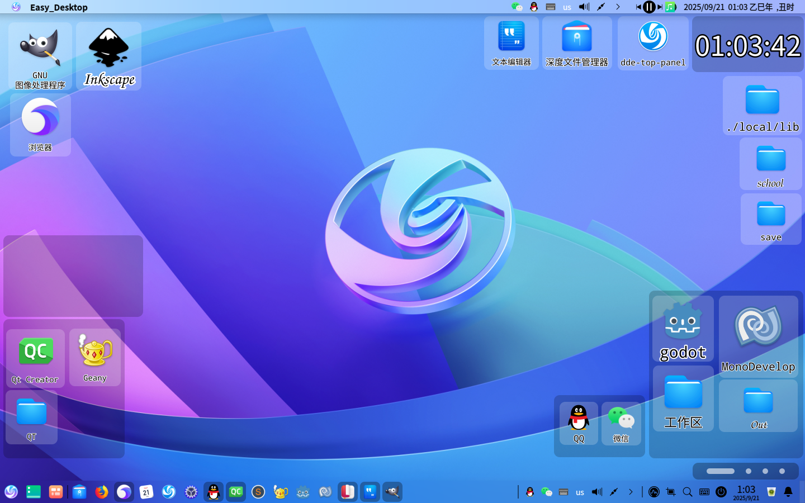
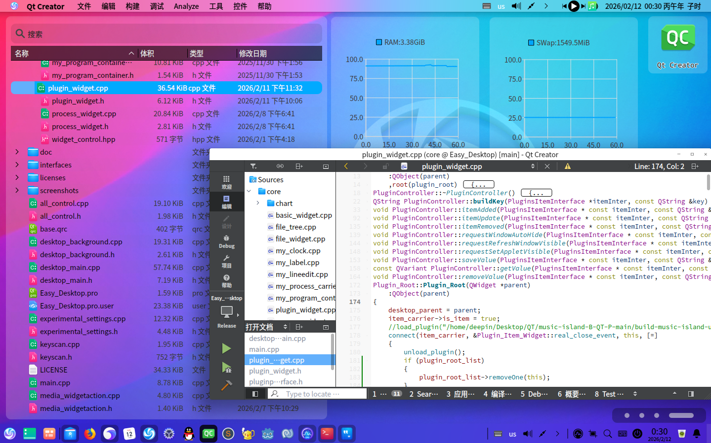
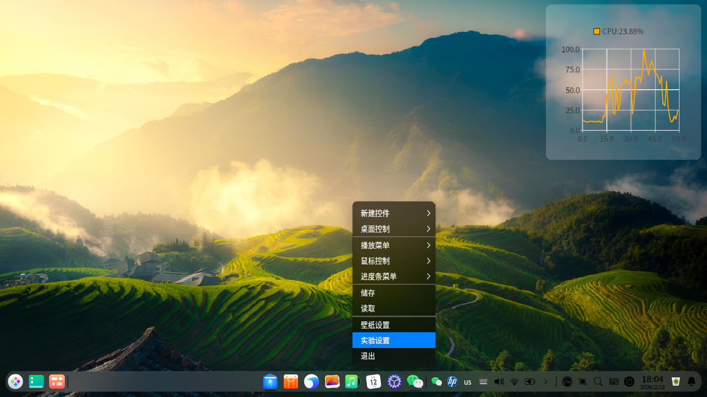
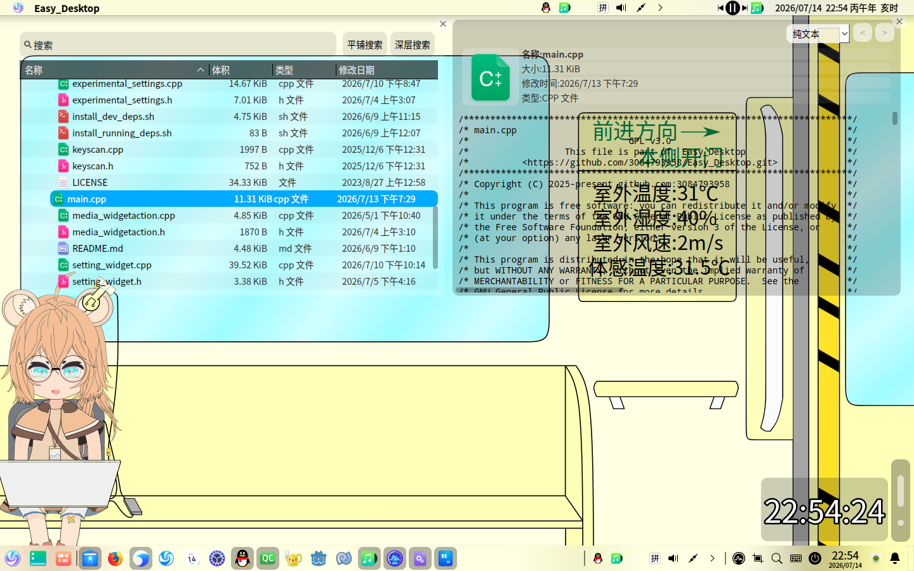

# Easy_Desktop
一个非常规桌面

## 软件截图









## 安装方法
1.安装本体

[https://github.com/3084793958/Easy_Desktop/releases/latest](https://github.com/3084793958/Easy_Desktop/releases/latest)

命名标准:Easy_Desktop_ + 支持名称(小写) 如:Easy_Desktop_chart_pdf,有折线图(QtChart驱动)与pdf支持

注:1.1.0 (AKA d26.7.15)版本及以后,Easy_Desktop支持一个虚拟的折线图,这是QPaintEvent驱动的,效果与QtChart相似,但图例是纵向的,在无chart标签的版本可使用(当然,chart标签下也是可以使用这个虚拟折线图的)

chart:折线图(QtChart驱动)(用于数据可视化)

pdf:pdf预览

dtk:dtk支持(用于DTK插件)

2.安装依赖

带有"chart"的Easy_Desktop运行依赖libqt5charts5

安装依赖指令:

```
sudo apt install libqt5charts5
```
带有"pdf"的Easy_Desktop运行依赖libqt5pdfwidgets5

安装依赖指令:

```
sudo apt install libqt5pdfwidgets5
```

3.tips

记得储存,Easy_Desktop不会帮你储存(/tmp那个是用来备份的)

## 关于编译
1.安装依赖

```
./install_dev_deps.sh
```

2.编译(这个过程大概要40min)

```
./build_deb.sh
```

3.取文件

在build/中,其中debs为*.deb输出路径,其他为各版本的编译路径

## 命令行控制服务

| 选项/方法 | 描述 |
|-----------|------|
| **命令行选项** | |
| `-config, -C <路径>` | 指定配置文件路径 |
| `-translation, -T <路径>` | 设置自定义翻译文件路径 |
| `-workspace, -WS <索引号>` | 设置工作空间索引 (0 表示任意空间) |
| `-dbus_id, -D_I <ID>` | 设置 dbus_id 号 |
| `-always_refresh, -A_R <布尔值>` | 是否持续刷新空间结构 (true/false) |
| `-Geometry, -G <x y width height>` | 设置空间结构 (设置后 `-always_refresh` 自动为 false) |
| `-send_dbus, -S_D <dbus_id> <方法> [参数]` | 发送 DBus 消息 |
| `-help, -H, --help` | 获取帮助 |
| `-version, -V` | 获取版本信息 |
| | |
| **DBus 方法** | |
| `save` | 储存 |
| `load` | 读取 |
| `exit` | 退出 |
| `config <路径>` | 设置配置文件路径 (不自动加载) |
| `-translation <路径>` | 设置自定义翻译文件路径 |
| `workspace <索引>` | 切换工作空间 |
| `geometry <值>` | 设置空间结构或刷新模式|
| | 格式1: `x y width height` (禁用自动刷新) |
| | 格式2: `true/false` (设置自动刷新开关) |
| `volume_slider <数值>` | 设置音量进度条 (取值范围: 0-100 的整数) |
| `position_slider <数值>` | 设置位置进度条 (取值范围: 0-100 的整数) |
| `speed_slider <数值>` | 设置速度进度条 (取值范围: 10-300 的整数) |
| `set_wallpaper <wallpaper_id>` | 设置壁纸 |
| `remove_wallpaper <wallpaper_id>` | 移除壁纸 |
| `add_wallpaper [参数]` | 添加壁纸，参数如下: ID(UInt32) 名称(String) 显示方式(String) [图像:true/视频:false] 路径(String) 缩放方式(String) [Scale_Type::No/Each/Width/Height/Short/Long/Full] 居中(String) [true/false] 鼠标效果(String) [true/false] 鼠标效果宽度系数(Double) 鼠标效果高度系数(Double) X轴偏移量(Int32) Y轴偏移量(Int32) 抗锯齿(String) [true/false] (鼠标控制类型(String)) [Mouse_Control_Type::Follow_Desktop/Mouse_Control_Type::Follow_Wallpaper] 自定宽(Int32) 自定高(Int32) |
| | |
| **使用示例** | |
| `./Easy_Desktop -G 0 0 1440 900` | 设置空间结构示例 |
| `./Easy_Desktop -S_D 0 add_wallpaper 0 deepin true /usr/share/wallpapers/deepin/Deepin-Technology-Brand-Logo.jpg Scale_Type::Full true true 0.1 0.1 0 0 true` | DBus 消息发送示例 |

## 开发版本

QT5.15.8 , C++11

## Easy_Desktop插件支持

### 接口
interface(新)(包含Ext_Plugin_Interface(dde-dock插件变体),Ext_Preview_PluginInterface(预览控件(Preview_File_Widget)的插件),Ext_Wallpaper_Interface(壁纸插件)):

[https://github.com/3084793958/Easy_Desktop_Plugin_Interface](https://github.com/3084793958/Easy_Desktop_Plugin_Interface)

interface(旧)(仅包含Ext_Plugin_Interface V0.0.1):

[https://github.com/3084793958/Ext_Plugin_Interface.git](https://github.com/3084793958/Ext_Plugin_Interface.git)

### 插件实例

music-island(Ext_Plugin_Interface) : [https://github.com/3084793958/music-island-B-QT-P](https://github.com/3084793958/music-island-B-QT-P)

Window_Container(Ext_Plugin_Interface) : [https://github.com/3084793958/Window_Container](https://github.com/3084793958/Window_Container)

PPT_LibreOffice_Previewer(Ext_Preview_PluginInterface) : [https://github.com/3084793958/PPT_LibreOffice_Previewer](https://github.com/3084793958/PPT_LibreOffice_Previewer)

Two_SOI_Previewer(Ext_Preview_PluginInterface) : [https://github.com/3084793958/Two_SOI_Previewer.git](https://github.com/3084793958/Two_SOI_Previewer.git)

Metro_Wallpaper(Ext_Wallpaper_Interface) : [https://github.com/3084793958/Metro_Wallpaper.git](https://github.com/3084793958/Metro_Wallpaper.git)