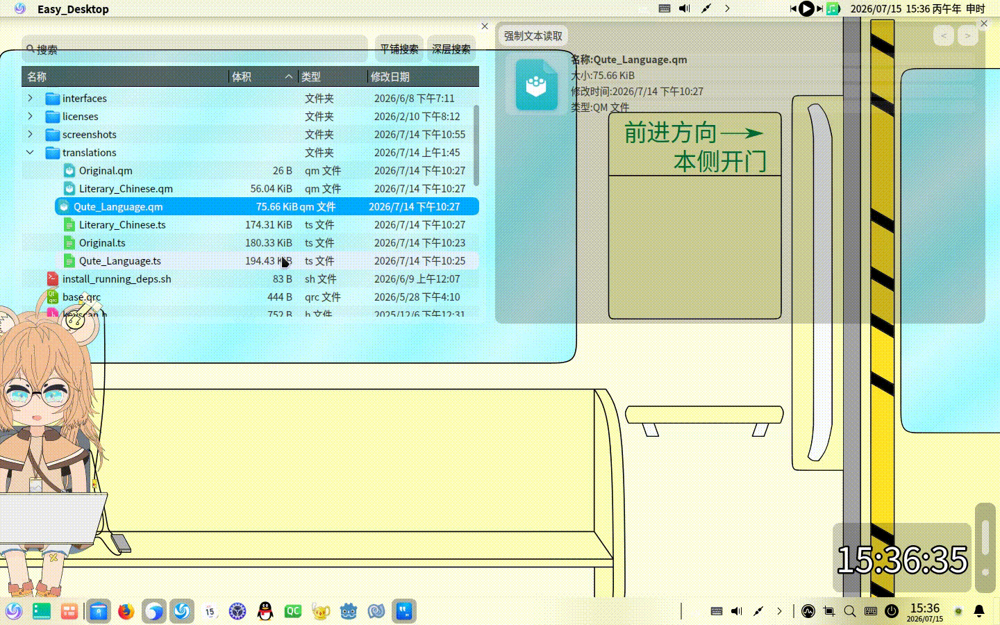
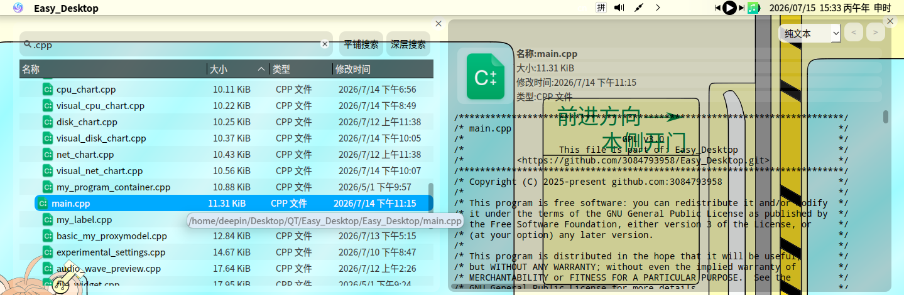
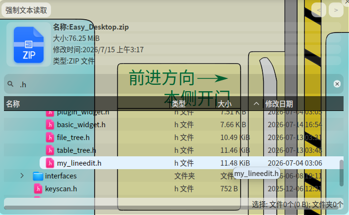
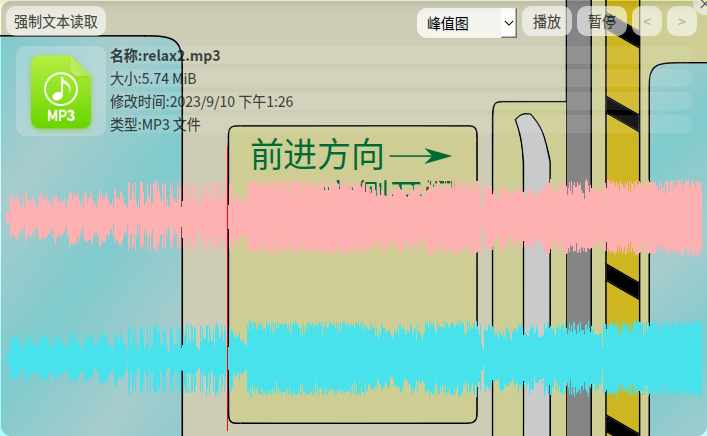
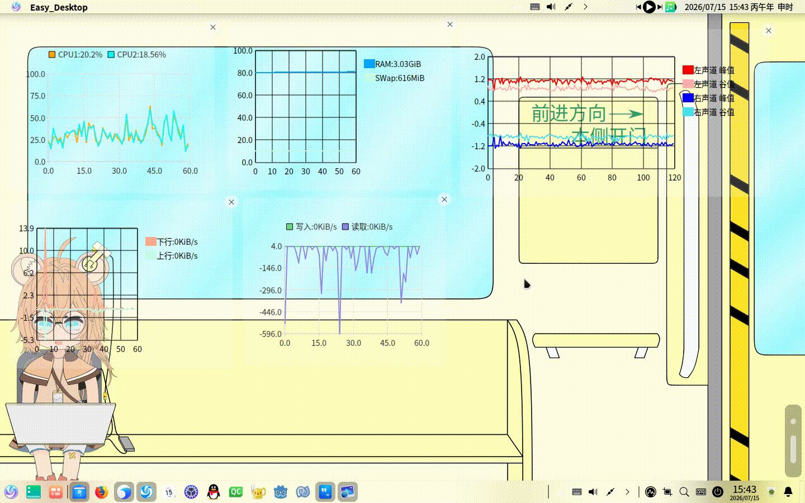
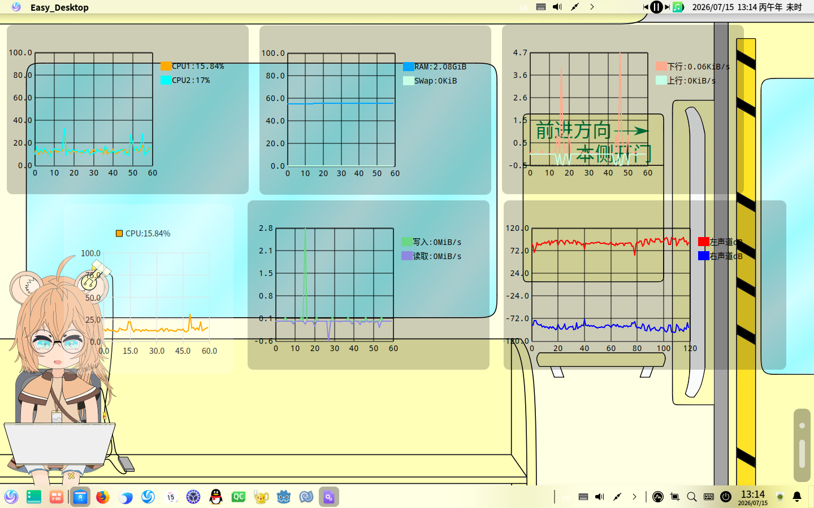

# 1.1.0-AKA-d26.7.15 更新日志

> **使用须知** ：Easy_Desktop 的配置修改后**不会自动保存**，需要用户在修改完毕后，通过 **右键 → 储存** 手动执行保存操作，请知悉。

> **题外话** ：本次更新因新增功能较多，二进制文件在 `strip` 后整体膨胀了约 **30%** 。

> 由于早期没读Qt文档，造了太多的轮子，这导致了Easy_Desktop代码量突破 **1024 KiB** 与 **36000 行** 。代码中仍有大量可优化空间。

> Easy_Desktop中的多行文本编辑器都已改为了Basic_LineEdit(这是个QTextEdit,我的问题,起错名了)(这个多行文本编辑器很强,支持 列编辑,行号标注,查找替换,单单她就独占了约80KiB)

## 大纲

### 0.版本号系统更新
### 1.安全机制求助
### 2.动态翻译：运行时热切换，告别重启等待
### 3.文件平铺搜索：补齐视图操作的最后一块拼图
### 4.文件夹视图的文件提示与被动刷新
### 5.音频文件波形图预览：让声音"看得见"
### 6.新增部分批量操作功能
### 7.QPaintEvent 驱动的数据可视化折线图：全平行版本标配
### 8.翻译文件：新增 Qute_Language.qm 翻译资源

## 版本号系统更新：

本次更新将版本号格式由原先的日期式（如 `d26.7.15`）正式切换为标准的语义化版本号 `1.1.0`。这只是为了符合规范，让版本命名更清晰。

`d26.7.15` 仍然保留。这是出于 **兼容性考量** ,也能说明是什么时候发布的嘛。

值得一提的是：**主版本号变更并不必然意味着破坏性更新**。当前最新版本依然能够完整读取最老版本的配置文件；而老版本在打开新版文件时，也会尽最大努力读取其中支持的部分数据。

## 安全机制求助

配置文件安全是桌面环境的重要防线。本次版本在 root 权限下增加了 **配置文件检查提示** ——当用户以 root 身份操作时，系统会主动提醒检查配置文件。这仅仅是个提示。

**在此向社区求助**：对于配置文件防篡改，是否有轻量且可靠的解决方案？欢迎各位开发者贡献思路与建议。

## 动态翻译：运行时热切换，告别重启等待

本次更新为"动态翻译"赋予了真正意义上的动态性。之前版本，界面语言的切换必须在应用启动前完成，任何一次翻译调整都意味着关闭程序、重新启动的繁琐流程。现在，这一限制被彻底打破。

可通过两种方式触发翻译更新：

- **界面操作**：在界面任意区域 **右键呼出菜单 → 高级设置 → 设置翻译** ，通过多行文本编辑器直接填入目标翻译文件（`.qm`）的绝对路径。编辑器中提供了引导提示：输入 `:/base/qtbase_zh_CN.qm` 即可调用 Qt 框架自带的中文翻译包。
- **DBus 调用**：支持通过 `send_dbus` 方式动态设置翻译，参数格式为 `-translation <路径>`。

本次翻译覆盖范围严格限定于 **UI 控件文字** （菜单、按钮、提示框等），不涉及用户业务数据。这项改进完全基于 Qt 标准的 `.qm` 翻译文件机制实现。

**插件接口同步更新**：随着动态翻译机制的引入，插件接口也迎来了同步升级。本次对全部 **3 个插件接口** [插件接口仓库](https://github.com/3084793958/Easy_Desktop_Plugin_Interface) 进行了修订，在 Interface 中新增了 `Trans_Update()` 方法。当翻译动态更新时，系统会主动调用该方法通知所有已加载的插件进行界面文字刷新。目前尚未有基于本次接口变更实现的插件，此举旨在做好基础设施准备。

## 文件平铺搜索：补齐视图操作的最后一块拼图

本次在原有搜索框旁增加了一个 `Trans_PushButton`（为实现动态翻译而派生的 `QPushButton` 类），是 **触发"平铺搜索"模式的开关** 。

所谓"平铺"，是对搜索结果呈现方式的精确定义：从当前目录出发，将所有匹配到的文件平铺陈列。具体显示风格取决于当前文件夹的视图模式——若当前处于 **树状视图** ，搜索结果将以 **单层列表视图** 展示；若当前处于 **图标视图** ，搜索结果则维持 **图标视图** 的卡片式布局。

在功能逻辑上，本次搜索采用**文件名字符串匹配（忽略大小写）**。此前版本的搜索 **搜索速度非常缓慢** 。本次补全了过滤逻辑(这是我的问题,之前没写过滤)，搜索速度实现了 **大幅跃升** 。更重要的是， **几乎文件管理器的所有常规操作（重命名、删除、移动、复制、右键菜单等）都能在搜索结果视图上直接执行** ——直到现在，视图才真正成为高效的工作台(对于我来说)。

## 文件夹视图的文件提示与被动刷新：

本次在用户体验的细微之处也下了功夫。首先是 **文件提示（Tooltip）** ：当鼠标悬停在文件列表的某一项上时，系统会根据悬停位置智能展示信息——若悬停于 **日期列** ，则弹出提示显示该文件的精确时间；若悬停在其他任意位置，则 **展示该文件的完整路径** 。这一提示功能不仅覆盖了文件管理的两大主力视图（树状列表视图与图标视图），还延伸到了 **预览Zip压缩包内容的视图** 中。

其次是 **被动刷新** 机制。这里的"被动"是相对于用户主动按下 `F5` 手动刷新而言的。当用户通过点击或键盘方向键 **改变当前选中的条目（currentIndex）** 时，系统会主动要求对应的 `ModelIndex` 执行一次重绘。这项改进直接修复了此前版本中文件大小等属性在外部变更后无法及时刷新的问题——例如，当用户在其他程序中修改了某个文件并保存后，返回管理器时，文件大小仍显示为旧值，必须手动刷新才能更新。如今，只要焦点发生移动，视图便会自动刷新对应项的数据，让信息始终保持最新。

这一功能的实现并非出于性能优化考量，而是源于搜索功能的联动需求：搜索视图在展示结果时，只显示文件名而缺失路径上下文，因此需要通过 Tooltip 将路径信息"还"给用户。由于搜索功能的视图 所用到的模型和代理,均已实现了 派生类，在 `data()` 方法中补充 Tooltip 数据的成本极低——属于"顺手而为"的改进。

## 音频文件波形图预览：让声音"看得见"

本次为音频文件的预览体验带来了质的飞跃——在预览窗口中打开一个音频文件时，可通过 **预览窗口右上角的 `QComboBox` 下拉菜单** ，或在预览区域 **右键呼出菜单** ，自由选择波形图的显示模式。可选模式包括： **不显示波形图、RMS（均方根）图、dB（分贝）图、峰值图** 四种。峰值图不仅限于预览窗口，还已同步集成到 **声音服务可视化图表** 中，可在声音服务界面内通过右键随时切换显示。

在交互层面，波形图支持 **鼠标滚轮缩放** 和 **拖拽平移** ，方便聚焦查看特定时间段的音频细节。波形图本身并不直接控制播放位置——跳转播放、定位等操作仍由预览窗口的右键菜单负责。

格式支持方面，波形图预览依赖于 `QAudioDecoder` 与系统 `MimeData` 的解析，理论上覆盖 Qt 所支持的所有主流音频格式（如 MP3、WAV、FLAC、AAC 等）。

性能方面，波形图加载采用 **异步机制** ，不会阻塞 UI 主线程；但渲染过程（即 `QPaintEvent`）中仍存在短暂卡顿，在性能较低的硬件（如 我的赛扬处理器）上约为 **1 到 3 秒** 。为了缓解拖拽与缩放时的重绘压力，提供了一个可配置项： **允许限制单通道最大数据量** 。当音频采样点数量超过该阈值时，系统会对区间内的采样点进行 **合并处理** ——将一个区间内的所有采样点合成为一个 **带正负号的 RMS 值** ，以此大幅降低需要绘制的数据点数量，显著减少每次重绘的计算开销，从而在长音频或高频操作场景下获得更流畅的视觉反馈。

## 新增部分批量操作功能：

本次新增了对 **内部子窗口（如预览窗口等）的批量操作能力** ，让用户在同时管理多个窗口时，告别逐一调整的繁琐。

目前已支持的批量操作包括：

-  **移动** ：批量调整窗口位置；
-  **缩放** ：统一改变窗口尺寸；
-  **设置关闭按钮的显示与位置** ：统一开关关闭按钮的可见性，以及将其置于窗口四个角中的任意一角（左上、右上、左下、右下）；
-  **设置选择按钮的位置** ：统一调整窗口内置选择按钮的布局方位（同样支持四个角）；
-  **设置是否允许选择** ：批量锁定或解锁窗口的可选状态（既然允许批量设置，意味着实际使用场景中往往是为了"统一禁止选择"）；
-  **设置背景色** ：批量更换窗口背景颜色；
-  **设置圆角** ：统一调整窗口边角的圆角半径；
-  **关闭窗口** ：批量关闭所有选中的子窗口；
-  **移动到另一页** ：将选中的窗口整体迁移至另一个分页容器中。

**实现机制** ：当某个窗口被操作时，系统检测其是否处于选中状态，若选中则发送一个信号。窗口在 `setParent` 时会自动连接到 **Desktop_Main** 或 **My_Process_Carrier**   容器，信号会被发送至对应容器。容器收到信号后，从当前的框选列表中 **过滤掉信号发送者自身** ，然后对其他所有选中的窗口执行对应的批量操作。

在交互方式上提供两种选择模式：

- 在 **Desktop_Main** 容器下，可通过 **框选（拖拽矩形选区）** 批量选中窗口，并支持按住 `Ctrl` 或 `Shift` 键进行追加或区间选择——体验与在文件管理器中框选文件一致。
- 在 **My_Process_Carrier** 容器下，由于该容器本身支持窗口拖拽移动操作，普通的无修饰键框选会与之冲突，因此 **框选时需配合 `Ctrl` 或 `Shift` 键使用** ，框选动作本身依然存在，只是需要通过这两个键来激活，以让位于窗口拖拽操作(毕竟My_Process_Carrier在Desktop_Main容器里嘛)。

这一功能在多窗口工作流中提供的效率提升是实实在在的——尤其适合需要频繁布局和整理大量预览窗口的场景。

## QPaintEvent 驱动的数据可视化折线图：全平行版本标配

本次对数据可视化折线图模块进行了 **底层重构与扩展** 。在之前的版本中，折线图功能依赖于 Qt 的 `QChart` 组件实现，因此只有在发布的二进制文件中 **带有 `chart` 字样的特定版本** 才拥有该功能，普通版本用户无法使用。

本次新增了基于 **`QPaintEvent` 手动绘制** 的折线图实现，与原有的 `QChart` 实现 **并行共存** 。在带有 `chart` 字样的版本中，可同时使用两种绘制方案；而在不带有 `chart` 字样的普通版本中，`QPaintEvent` 实现补齐了这一功能缺口，使得 **所有平行版本均默认自带数据可视化能力** ，不再因版本差异而缺失核心监控功能。

**实现细节** ：`QPaintEvent` 驱动方式采用了 **虚构一个 `QChart` 对象** 的策略，使得原有的 `CPU_Chart`、`RAM_Chart` 等类在接入新绘制引擎时 **无需大幅修改代码** 便可直接复用。

注:图例在 **上方** 的是QChart驱动的,图例在 **右边** 的是QPaintEvent驱动的

该折线图组件覆盖的数据监控维度包括：

-  **CPU 使用率** ：支持同时绘制 **所有核心** 的使用率曲线（当 `channel` 参数设为 `-1` 时），多核状态一目了然；
-  **内存占用** ：独立显示 **RAM** 与 **Swap** 各自的 **占比** ，各自以独立的百分比形式呈现；
-  **网络上下行** ：实时绘制网络接收与发送流量的变化趋势；
-  **磁盘读写** ：展示磁盘 I/O 的读写速率曲线；
-  **声音服务** ：基于 **PulseAudio** 服务实时读取音频数据，动态绘制声音的 **RMS 图、dB 图与峰值图** ——这与前面"音频文件波形图预览"中的峰值图属于同一套视觉体系，实现了从"文件播放预览"到"实时音频监控"的全链路可视化覆盖。

在数据采集方式上，前四项（CPU、内存、网络、磁盘）通过 **读取系统文件** 获取实时数据，声音服务则通过 PulseAudio 接口获取音频流。

## 翻译文件：新增 Qute_Language.qm 翻译资源

本次在仓库中新增了一个翻译文件 `Qute_Language.qm`。该文件作为项目的自定义翻译资源，与"动态翻译"机制紧密配合——可通过 `右键 → 高级设置 → 设置翻译` 路径，在翻译路径编辑器中填入该文件的路径，或通过 DBus 调用 `-translation` 参数指定该文件，即可在运行时动态切换到这套新的翻译方案，无需重启应用。

`Qute_Language.qm` 的加入既丰富了界面语言的可选范围，也为后续扩展更多自定义翻译资源奠定了基础。

---

以上即为 Easy_Desktop `1.1.0-AKA-d26.7.15` 版本的全部更新内容。七项改进涵盖版本规范、界面交互、性能优化、数据可视化与多语言支持等多个维度。感谢一路以来的支持与反馈，下个版本再见。

仓库地址:[https://github.com/3084793958/Easy_Desktop.git](https://github.com/3084793958/Easy_Desktop.git)

---

