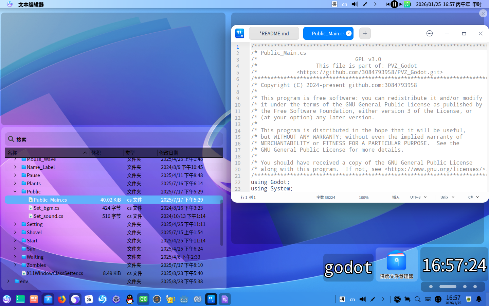
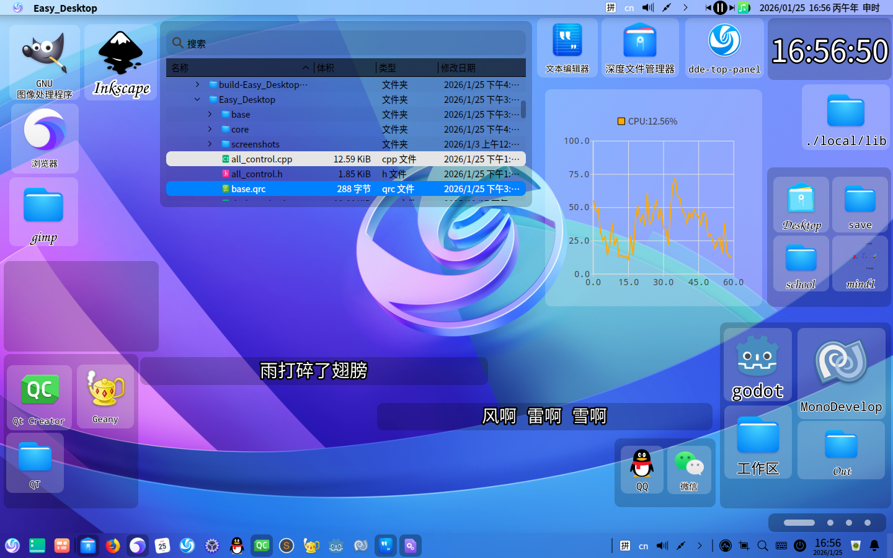
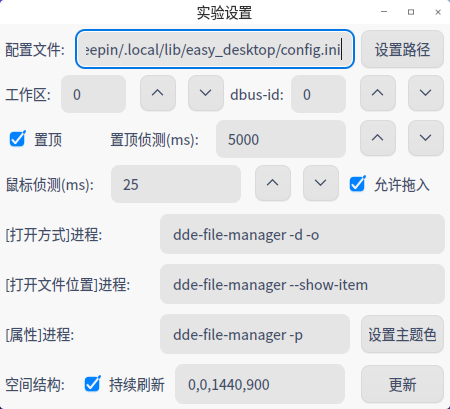

# 26.1.25更新
## 新控件
树状文件视图

## dbus接收

My_Label新增dbus接收服务

歌词是[music-island(插件)](https://github.com/3084793958/music-island-B-QT-P)的dbus服务,上周已更新

## 外观

允许修改菜单的颜色(这里是将alpha调低)(看起来好像比正常的小一点)

## 实验设置

允许拖入文件创建file_widget

顺便在my_process_carrier做了批量导入

允许修改"打开文件所在位置"所调用的程序(之前一直是dde-file-manager)

## 备份机制

每30s会在/tmp/Easy_Desktop/backup_config.ini中备份

## 链接
项目地址:[https://github.com/3084793958/Easy_Desktop](https://github.com/3084793958/Easy_Desktop)

前传: [https://bbs.deepin.org/post/294712](https://bbs.deepin.org/post/294712)