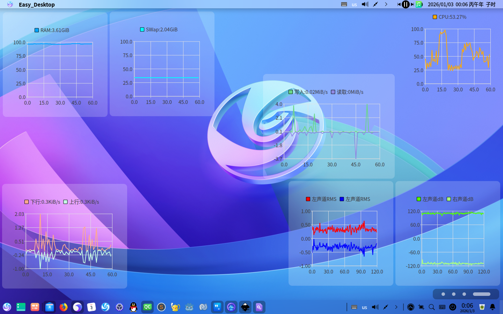
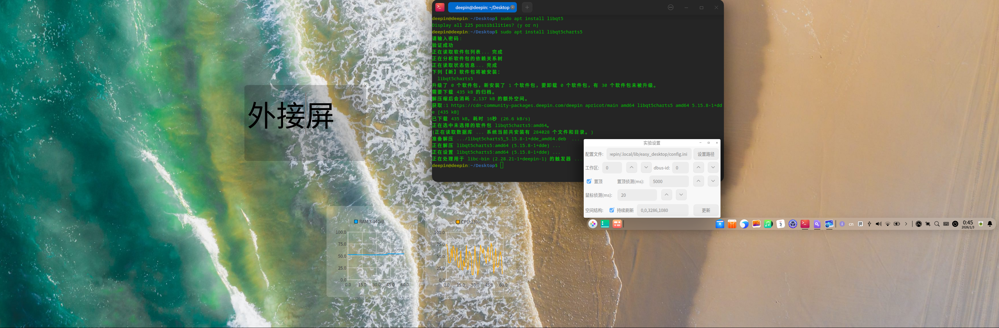

# 26.1.3更新
## 新控件
CPU,内存,网络,磁盘,声音服务对应的可视化图标 //(要对 空指针,爆列表 敏锐点)

"内存"中RAM和SWap是分开的

若在"网络" "磁盘"中使用非等差轴,请注意单位

由于"声音服务"需要连续密集侦测,故耗能较高
## 窗口
新增"实验设置"窗口

注:除"置顶" "置顶侦测" "鼠标侦测"之外的数据不会存储到config中,可用运行参数对其设置

## 运行参数
可以使用终端控制Easy_Desktop

如: ./Easy_Desktop -C ./config.ini 可使./config.ini作为./Easy_Desktop的配置文件

## 其他
1.对进程按钮增加hover效果

2.允许批量导入图像,视频作为壁纸

3.对于多屏幕可以通过修改空间结构(geometry)的方式得到如下效果

4.通过设置工作区可使得Easy_Desktop仅在某工作区显示(0为所有工作区)

5.依靠dbus,只要知道某个Easy_Desktop的dbus_id,便可以控制他
## 依赖
运行需要依赖 libqt5charts5

安装: sudo apt install libqt5charts5
## 未解决的问题
不知道什么原因,当运行参数(argv[i])为"-geometry"时,会判定该参数与下一参数结合(如 -geometry 0 0 0 0被分解成-geometry 0, 0, 0, 0)

这会导致跳转到最后一个else分支,但用"-Geometry"能正常工作

但用纯C++写两个都能过(编译命令:g++ app.cpp)
## 链接
项目地址:[https://github.com/3084793958/Easy_Desktop](https://github.com/3084793958/Easy_Desktop)

前传: [https://bbs.deepin.org/post/291712](https://bbs.deepin.org/post/291712)