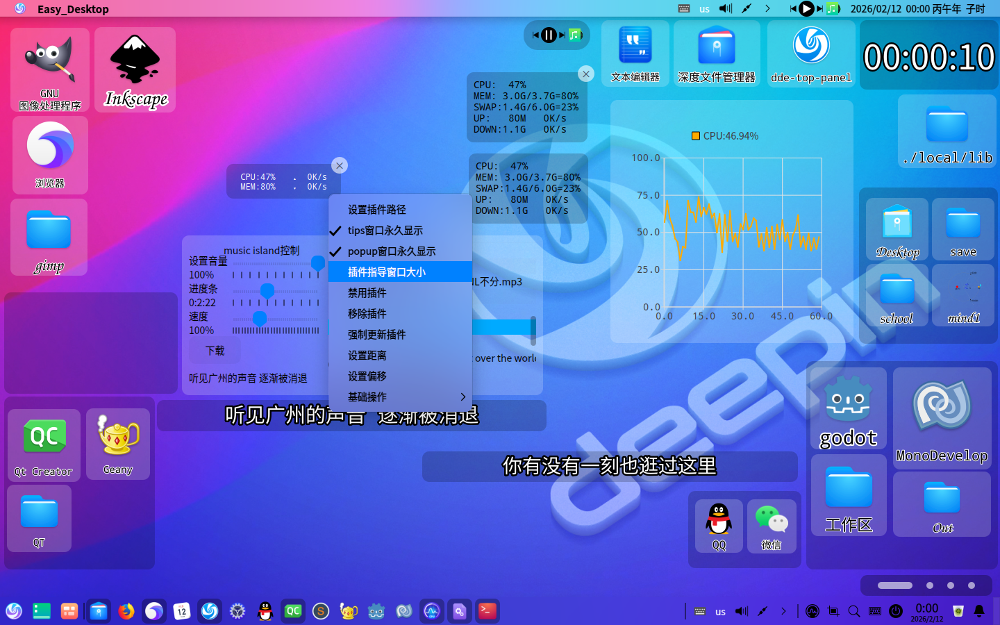
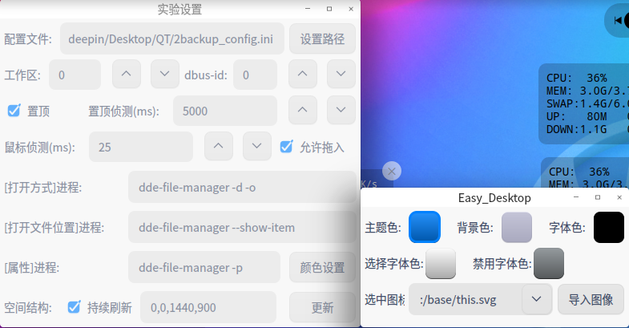
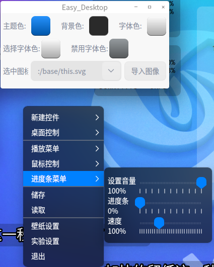
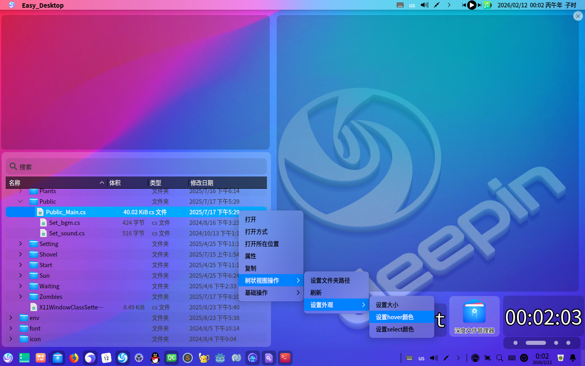

# 26.2.12更新

## 1.新增插件窗口



插件为dde-dock插件.编写指导:[https://github.com/linuxdeepin/dde-dock/blob/master/plugins/plugin-guide/plugins-developer-guide.md](https://github.com/linuxdeepin/dde-dock/blob/master/plugins/plugin-guide/plugins-developer-guide.md)

**dde-dock插件接收器的写法放在文末**

对于某些插件Easy_Desktop无法读取,如libtray.so. *//我已经没招了,也不知道哪里冒出来的空指针*

载入时的报错信息 与 debug得到的汇编码 如下:

```
init Fashion mode tray plugin item
delay load 0 "keybord_layout" IndicatorTray(0x1b03c80)
using system tray plugins dir: "/usr/lib/dde-dock/plugins/system-trays"
/usr/bin/ldd: 第 119 行：printf: 写错误: 断开的管道
/usr/bin/ldd: 第 119 行：printf: 写错误: 断开的管道
/usr/bin/ldd: 第 119 行：printf: 写错误: 断开的管道
/usr/bin/ldd: 第 119 行：printf: 写错误: 断开的管道
/usr/bin/ldd: 第 119 行：printf: 写错误: 断开的管道
/usr/bin/ldd: 第 119 行：printf: 写错误: 断开的管道
===============init=============
"SystemTray" init plugin:  "airplane-mode"
"SystemTray" init plugin finished:  "airplane-mode"
"SystemTray" init plugin:  "bluetooth"
"SystemTray" init plugin finished:  "bluetooth"
"SystemTray" init plugin:  "disk-mount"
```

```
0x7ffff66caec0                  48 8b 47 08  mov    0x8(%rdi),%rax
0x7ffff66caec4  <+    4>        48 8b 40 38  mov    0x38(%rax),%rax
0x7ffff66caec8  <+    8>        48 8b 40 38  mov    0x38(%rax),%rax
0x7ffff66caecc  <+   12>        c3           ret
```

## 2.调色盘:用于调整右键菜单的颜色





## 3.树状视图外观




## 4.命令行控制服务更新

| 选项/方法 | 描述 |
|-----------|------|
| **命令行选项** | |
| `-config, -C <路径>` | 指定配置文件路径 |
| `-workspace, -WS <索引号>` | 设置工作空间索引 (0 表示任意空间) |
| `-dbus_id, -D_I <ID>` | 设置 dbus_id 号 |
| `-always_refresh, -A_R <布尔值>` | 是否持续刷新空间结构 (true/false) |
| `-Geometry, -G <x y width height>` | 设置空间结构 (设置后 `-always_refresh` 自动为 false) |
| `-send_dbus, -S_D <dbus_id> <方法> [参数]` | 发送 DBus 消息 |
| | |
| **DBus 方法** | |
| `save` | 储存 |
| `load` | 读取 |
| `exit` | 退出 |
| `config <路径>` | 设置配置文件路径 (不自动加载) |
| `workspace <索引>` | 切换工作空间 |
| `geometry <值>` | 设置空间结构或刷新模式|
| | 格式1: `x y width height` (禁用自动刷新) |
| | 格式2: `true/false` (设置自动刷新开关) |
| `volume_slider <数值>` | 设置音量进度条 (取值范围: 0-100 的整数) |
| `position_slider <数值>` | 设置位置进度条 (取值范围: 0-100 的整数) |
| `speed_slider <数值>` | 设置速度进度条 (取值范围: 10-300 的整数) |
| `set_wallpaper <wallpaper_id>` | 设置壁纸 |
| `remove_wallpaper <wallpaper_id>` | 移除壁纸 |
| `add_wallpaper [参数]` | 添加壁纸，参数如下: ID(UInt32) 名称(String) 显示方式(String) [图像:true/视频:false] 路径(String) 缩放方式(String) [Scale_Type::No/Each/Width/Height/Short/Long/Full] 居中(String) [true/false] 鼠标效果(String) [true/false] 鼠标效果宽度系数(Double) 鼠标效果高度系数(Double) X轴偏移量(Int32) Y轴偏移量(Int32) 抗锯齿(String) [true/false] |
| | |
| **使用示例** | |
| `./Easy_Desktop -G 0 0 1440 900` | 设置空间结构示例 |
| `./Easy_Desktop -S_D 0 add_wallpaper 0 deepin true /usr/share/wallpapers/deepin/Deepin-Technology-Brand-Logo.jpg Scale_Type::Full true true 0.1 0.1 0 0 true` | DBus 消息发送示例 |

## 5.动态壁纸中的播放进度会被存档

## 6.安装方法

1.安装依赖

tips:Easy_Desktop运行依赖libqt5charts5

安装依赖指令:

```
sudo apt install libqt5charts5
```

2.安装本体

[https://github.com/3084793958/Easy_Desktop/releases/download/26.2.12/Easy_Desktop](https://github.com/3084793958/Easy_Desktop/releases/download/26.2.12/Easy_Desktop)

记得储存,Easy_Desktop不会帮你储存(/tmp那个是用来备份的)

重新录了一个视频演示[https://www.bilibili.com/video/BV1JkcizWELT/](https://www.bilibili.com/video/BV1JkcizWELT/)

## 相关链接
项目地址:[https://github.com/3084793958/Easy_Desktop](https://github.com/3084793958/Easy_Desktop)

前传: [https://bbs.deepin.org/post/295277](https://bbs.deepin.org/post/295277)

# dde-dock插件接收器的写法

core/plugin_widget.h 和 core/plugin_widget.cpp中的写法是Easy_Desktop的特殊化写法,写的时候不必像我这么写

在[dde-dock插件编写指导](https://github.com/linuxdeepin/dde-dock/blob/master/plugins/plugin-guide/plugins-developer-guide.md)中写了dde-dock插件的实现方法,对于 插件接收器 ,做一个逆运算即可

## 1.dde-dock插件接口

dde-dock插件接口 会告诉 **dde-dock插件能做什么** 和 **接收器能调用插件的哪些功能**

插件接口一般在如下位置

```
/usr/include/dde-dock/pluginproxyinterface.h
/usr/include/dde-dock/pluginsiteminterface.h
```

如果没有,有两种解决方案:

1.安装依赖

```
sudo apt install dde-dock-dev
```

2.为了方便编译,我在Easy_Desktop的源码中放了相同的接口定义文件

```
./interfaces/constants.h
./interfaces/pluginproxyinterface.h
./interfaces/pluginsiteminterface.h
```

注:只有插件和接收器使用的接口定义相同,插件才能正常加载

Easy_Desktop中用的接口与最新的dde-dock接口不同(我在deepin20.9开发),dde-dock的新接口好像加了很多新东西,希望能够兼容吧

## 2.定义接口实现方法

pluginproxyinterface.h 和 pluginsiteminterface.h 中的定义很简单,有些甚至没有定义,我们需要override他来实现对应的功能

在此之前,先include一些必要的东西

```c++
// .h

#include <QPluginLoader>
#include <QCoreApplication>
#include <interfaces/pluginsiteminterface.h> 
//插件接口,如果用的是方案1去解决,改为 #include <dde-dock/pluginsiteminterface.h>

#include <QtWidgets>
```

定义插件实现方法*PluginController*

*Plugin_Root*将用于联系 接口与GUI,使PluginController能直接控制GUI

当然,用emit发信号的方式也是可以的,只不过当时的我没想到

```c++
// .h

class Plugin_Root;
class PluginController : public QObject, public PluginProxyInterface
{
    Q_OBJECT
public:
    explicit PluginController(QObject *parent = nullptr, Plugin_Root *plugin_root = nullptr);
    ~PluginController() override;
    virtual void itemAdded(PluginsItemInterface * const itemInter, const QString &itemKey) override;
    virtual void itemUpdate(PluginsItemInterface * const itemInter, const QString &itemKey) override;
    virtual void itemRemoved(PluginsItemInterface * const itemInter, const QString &itemKey) override;
    virtual void requestWindowAutoHide(PluginsItemInterface * const itemInter, const QString &itemKey, const bool autoHide) override;
    virtual void requestRefreshWindowVisible(PluginsItemInterface * const itemInter, const QString &itemKey) override;
    virtual void requestSetAppletVisible(PluginsItemInterface * const itemInter, const QString &itemKey, const bool visible) override;
    virtual void saveValue(PluginsItemInterface * const itemInter, const QString &key, const QVariant &value) override;
    virtual const QVariant getValue(PluginsItemInterface *const itemInter, const QString &key, const QVariant& fallback = QVariant()) override;
    virtual void removeValue(PluginsItemInterface *const itemInter, const QStringList &keyList) override;
private:
    Plugin_Root *root = nullptr;
    QSettings *m_settings = nullptr;
    QString buildKey(PluginsItemInterface *itemInter, const QString &key) const;//用于处理数据
};
```

之后在.cpp文件中逐个实现这些方法即可

这里类出几个重要的定义

```c++
//.cpp

PluginController::PluginController(QObject *parent, Plugin_Root *plugin_root)
    :QObject(parent)
    ,root(plugin_root)
{
    m_settings = new QSettings("Easy_Desktop", "plugins", this);
}
PluginController::~PluginController()
{
    m_settings->sync();
}
QString PluginController::buildKey(PluginsItemInterface *itemInter, const QString &key) const
{
    if (itemInter)
    {
        return QString("%1/%2").arg(itemInter->pluginName()).arg(key);
    }
    else
    {
        return QString("unknown_plugin/%1").arg(key);
    }
}
void PluginController::saveValue(PluginsItemInterface * const itemInter, const QString &key, const QVariant &value)
{
    QString fullKey = buildKey(itemInter, key);
    m_settings->setValue(fullKey, value);
}
const QVariant PluginController::getValue(PluginsItemInterface * const itemInter, const QString &key, const QVariant &fallback)
{
    QString fullKey = buildKey(itemInter, key);
    QVariant value = m_settings->value(fullKey, fallback);
    return value;
}
void PluginController::removeValue(PluginsItemInterface * const itemInter, const QStringList &keyList)
{
    for (const QString &key : keyList)
    {
        QString fullKey = buildKey(itemInter, key);
        m_settings->remove(fullKey);
    }
}
```

方法作用在[dde-dock插件编写指导](https://github.com/linuxdeepin/dde-dock/blob/master/plugins/plugin-guide/plugins-developer-guide.md)中写得很详细

记得用itemInter->itemContextMenu(itemKey);实现右键菜单

然后用plugin_interface->invokedMenuItem(plugin_itemKey, menuId, checked);发给插件

itemInter->itemContextMenu(itemKey);只能被调用1次

还有就是单击主控件时需要执行plugin_interface->itemCommand(plugin_itemKey);

**Easy_Desktop中右键菜单的构建方法**

Plugin_Item_Widget是用于显示主控件的控件

在PluginController::itemAdded(PluginsItemInterface * const itemInter, const QString &itemKey)中调用
Plugin_Item_Widget::set_extra_menu(itemInter->itemContextMenu(itemKey));即可

```c++
void set_extra_menu(QString data);
void parseMenuItemsArray(QMenu *parentMenu, const QJsonArray &itemsArray, bool checkableMenu, bool singleCheck);
void parseMenuItemsArray(const QJsonArray &itemsArray, bool checkableMenu, bool singleCheck);


void Plugin_Item_Widget::set_extra_menu(QString data)
{
    for (auto child : plugin_extra_context_menu->children())
    {
        child->disconnect();
        child->deleteLater();
    }
    if (data.isEmpty())
    {
        use_plugin_context = false;
        return;
    }
    else
    {
        use_plugin_context = true;
        QJsonParseError error;
        QJsonDocument doc = QJsonDocument::fromJson(data.toUtf8(), &error);
        if (error.error != QJsonParseError::NoError)
        {
            return;
        }
        if (!doc.isObject())
        {
            return;
        }
        //(O_O)!好像没有详细定义
        QJsonObject menuObj = doc.object();
        bool checkableMenu = menuObj["checkableMenu"].toBool(false);
        bool singleCheck = menuObj["singleCheck"].toBool(false);
        if (singleCheck && checkableMenu)
        {
            QActionGroup *exclusiveGroup = new QActionGroup(plugin_extra_context_menu);
            exclusiveGroup->setExclusive(true);
        }
        if (!menuObj.contains("items") || !menuObj["items"].isArray())
        {
            return;
        }
        QJsonArray itemsArray = menuObj["items"].toArray();
        parseMenuItemsArray(itemsArray, checkableMenu, singleCheck);
    }
}
void Plugin_Item_Widget::parseMenuItemsArray(const QJsonArray &itemsArray, bool checkableMenu, bool singleCheck)
{
    QActionGroup *exclusiveGroup = nullptr;
    if (singleCheck && checkableMenu)
    {
        exclusiveGroup = new QActionGroup(plugin_extra_context_menu);
        exclusiveGroup->setExclusive(true);
    }
    for (const QJsonValue &itemValue : itemsArray)
    {
        if (!itemValue.isObject())
        {
            continue;
        }
        QJsonObject itemObj = itemValue.toObject();
        QString itemId = itemObj["itemId"].toString();
        QString itemText = itemObj["itemText"].toString();
        bool isActive = itemObj["isActive"].toBool(true);
        if (itemText.isEmpty())
        {
            continue;
        }
        QAction *action = plugin_extra_context_menu->addAction(itemText);
        if (!itemId.isEmpty())
        {
            action->setData(itemId);
        }
        action->setEnabled(isActive);
        if (checkableMenu)
        {
            action->setCheckable(true);
            if (itemObj.contains("checked"))
            {
                bool checked = itemObj["checked"].toBool(false);
                action->setChecked(checked);
            }
            if (singleCheck && exclusiveGroup)
            {
                exclusiveGroup->addAction(action);
            }
        }
        if (itemObj.contains("items") && itemObj["items"].isArray())
        {
            QMenu *subMenu = new QMenu(itemText, plugin_extra_context_menu);
            action->setMenu(subMenu);
            QJsonArray subItemsArray = itemObj["items"].toArray();
            parseMenuItemsArray(subMenu, subItemsArray, checkableMenu, singleCheck);
        }
        connect(action, &QAction::triggered, this, [this, action, itemId]
        {
            emit this->extra_menu_call(itemId, action->isChecked());
        });
    }
}
void Plugin_Item_Widget::parseMenuItemsArray(QMenu* parentMenu, const QJsonArray& itemsArray, bool checkableMenu, bool singleCheck)
{
    QActionGroup *exclusiveGroup = nullptr;

    if (singleCheck && checkableMenu)
    {
        exclusiveGroup = new QActionGroup(parentMenu);
        exclusiveGroup->setExclusive(true);
    }
    for (const QJsonValue &itemValue : itemsArray)
    {
        if (!itemValue.isObject())
        {
            continue;
        }
        QJsonObject itemObj = itemValue.toObject();
        QString itemId = itemObj["itemId"].toString();
        QString itemText = itemObj["itemText"].toString();
        bool isActive = itemObj["isActive"].toBool(true);
        if (itemText.isEmpty())
        {
            continue;
        }
        QAction *action = parentMenu->addAction(itemText);
        if (!itemId.isEmpty())
        {
            action->setData(itemId);
        }
        action->setEnabled(isActive);
        if (checkableMenu)
        {
            action->setCheckable(true);
            if (itemObj.contains("checked"))
            {
                bool checked = itemObj["checked"].toBool(false);
                action->setChecked(checked);
            }
            if (singleCheck && exclusiveGroup)
            {
                exclusiveGroup->addAction(action);
            }
        }
        if (itemObj.contains("items") && itemObj["items"].isArray())
        {
            QMenu *subMenu = new QMenu(itemText, parentMenu);
            action->setMenu(subMenu);
            QJsonArray subItemsArray = itemObj["items"].toArray();
            parseMenuItemsArray(subMenu, subItemsArray, checkableMenu, singleCheck);
        }
        connect(action, &QAction::triggered, this, [this, action, itemId]
        {
            emit this->extra_menu_call(itemId, action->isChecked());
        });
    }
}
```

单击主控件实现

```c++
void Plugin_Root::click_call()
{
    QObject *pluginInstance = plugin_loader->instance();
    if (pluginInstance)
    {
        PluginsItemInterface *plugin_interface = qobject_cast<PluginsItemInterface *>(pluginInstance);
        if (plugin_interface)
        {
            QString command = plugin_interface->itemCommand(plugin_itemKey);
            if (command.isNull() || command.isEmpty()) return;
            QProcess process;
            process.setProgram("/bin/bash");
            process.setArguments(QStringList() << "-c" << command);
            process.setStandardOutputFile("/dev/null");
            process.setStandardErrorFile("/dev/null");
            process.startDetached();
        }
    }
}
```

## 3.实现插件载入

以下是载入函数

```c++
void Plugin_Root::load_plugin(QString filepath)
{
    unload_plugin(); //卸载插件,不过这是一个危险操作
    if (filepath.isEmpty()) return;
    plugin_loader->setFileName(filepath);
    if (!plugin_loader->load())
    {
        qDebug() << "插件导入失败:" << plugin_loader->errorString();
        return;
    }
    QObject *pluginInstance = plugin_loader->instance();
    if (!pluginInstance)
    {
        plugin_loader->unload();
        return;
    }
    PluginsItemInterface *plugin_interface = qobject_cast<PluginsItemInterface *>(pluginInstance);
    if (plugin_interface)
    {
        plugin_interface->init(plugin_controller);
        plugin_controller->itemUpdate(plugin_interface, ""); //强制更新插件
    }
}
```

## 4.实现插件禁用

通过 plugin_interface->pluginIsAllowDisable(); plugin_interface->pluginIsDisable(); plugin_interface->pluginStateSwitched();即可实现

## 5.实现插件卸载

这是一个危险操作

dde-dock是在启动是载入插件,运行时处理插件的启用与禁用,所以dde-dock不需要处理插件卸载

有趣的是 接口定义 文件中是这么定义的

```c++
    ///
    /// \brief init
    /// init your plugins, you need to save proxyInter to m_proxyInter
    /// member variable. but you shouldn't free this pointer.
    /// \param proxyInter
    /// DON'T try to delete this pointer.
    ///
    virtual void init(PluginProxyInterface *proxyInter) = 0;
```

也就是说,dde-dock插件无法卸载?

能不能卸载以后再说

在Easy_Desktop中用 禁用插件+隐藏窗口 实现的,析构时不会删除,而是隐藏only_hide(),当然,也保留手动删除的方式unload_plugin()

```c++
Plugin_Root::~Plugin_Root()
{
    //this->setParent(nullptr);
    only_hide();
    return;//偷天还日
}
void Plugin_Root::only_hide()
{
    this->setParent(nullptr);
    if (!plugin_loader->isLoaded())
    {
        unload_plugin();
        if (plugin_root_list)
        {
            plugin_root_list->removeOne(this);
        }
        has_been_closed = true;
        this->deleteLater();
        return;
    }
    if (has_been_closed) return;
    has_been_closed = true;
    QObject *pluginInstance = plugin_loader->instance();
    if (pluginInstance)
    {
        PluginsItemInterface *plugin_interface = qobject_cast<PluginsItemInterface *>(pluginInstance);
        if (plugin_interface)
        {
            if (plugin_interface->pluginIsAllowDisable())
            {
                if (!plugin_interface->pluginIsDisable())
                {
                    plugin_interface->pluginStateSwitched();
                }
            }
        }
    }
    if (plugin_root_list)
    {
        plugin_root_list->removeOne(this);
    }
    item_carrier->is_item = false;
    plugin_path.clear();
    item_carrier->remove_widget();
    if (item_widget) item_widget->hide();
    tips_carrier->remove_widget();
    if (tips_widget) tips_widget->hide();
    popup_carrier->remove_widget();
    if (popup_widget) popup_widget->hide();
    item_carrier->hide();
    tips_carrier->hide();
    popup_carrier->hide();
    item_carrier->deleteLater();
    tips_carrier->deleteLater();
    popup_carrier->deleteLater();
}
void Plugin_Root::unload_plugin()
{
    if (!plugin_loader->isLoaded()) return;
    QObject *pluginInstance = plugin_loader->instance();
    if (pluginInstance)
    {
        PluginsItemInterface *plugin_interface = qobject_cast<PluginsItemInterface *>(pluginInstance);
        if (plugin_interface)
        {
            if (plugin_interface->pluginIsAllowDisable() && !plugin_interface->pluginIsDisable())
            {
                plugin_interface->pluginStateSwitched();
            }
        }
    }
    item_carrier->set_extra_menu(QString());
    item_carrier->remove_widget();
    tips_carrier->remove_widget();
    popup_carrier->remove_widget();
    if (item_widget) item_widget->hide();
    if (tips_widget) tips_widget->hide();
    if (popup_widget) popup_widget->hide();
    item_widget = nullptr;
    tips_widget = nullptr;
    popup_widget = nullptr;
    plugin_loader->unload();//奇怪点:手动禁用有效,自动无效
    plugin_path.clear();
    follow_plugin_show_after_load = true;
}
```

## 6.连接GUI

你写着写着就会发现需要的函数越来越多的,先写再说
