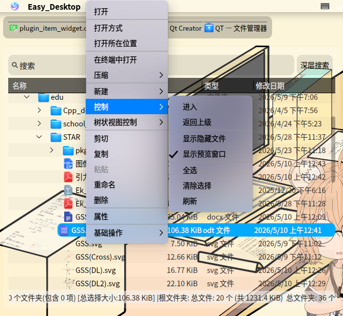
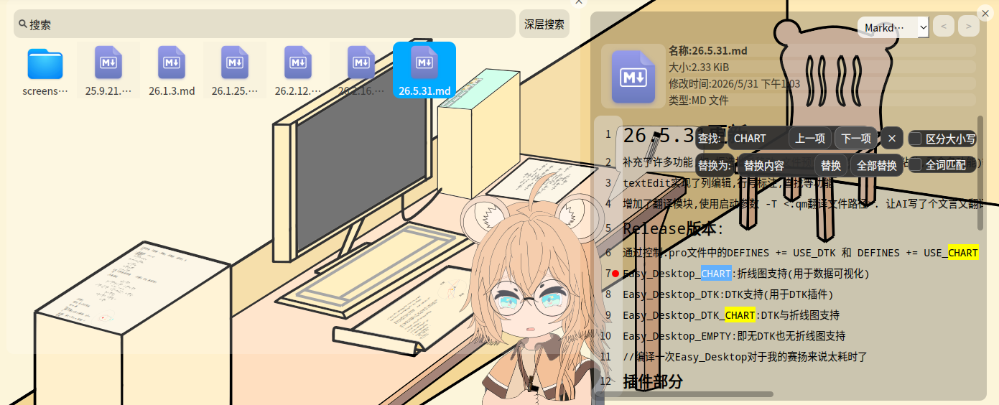
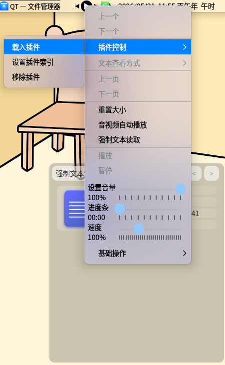
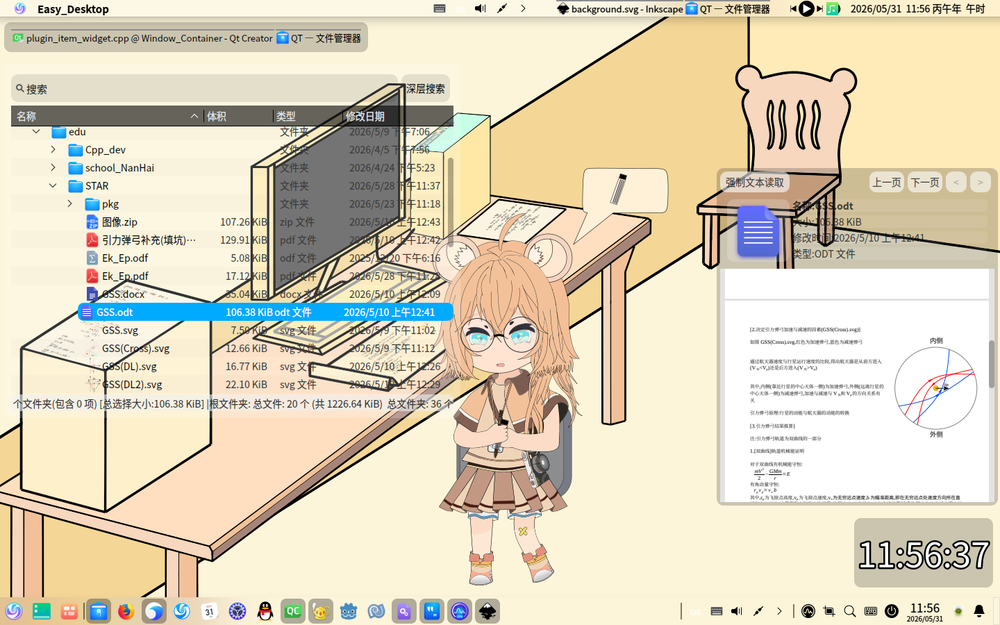
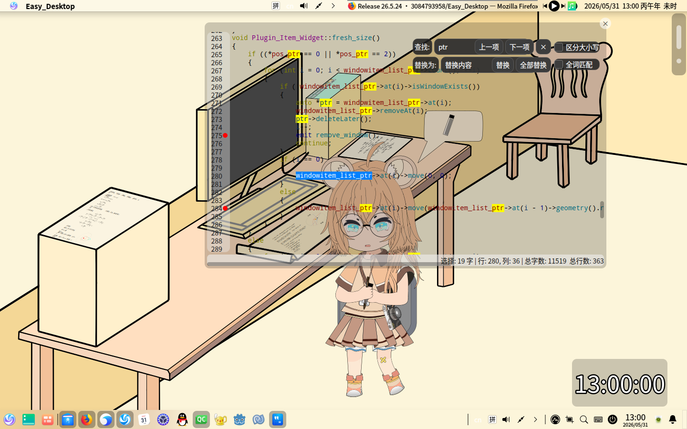

# 26.5.31更新

补充了许多功能,如:框选批量移动,文件预览,文件控制(复制,粘贴,重命名功能)等

textEdit实现了列编辑,行号标注,查找等功能

增加了翻译模块,使用启动参数 -T <.qm翻译文件路径>. 让AI写了个文言文翻译,但似乎效果不好(翻译文件和模板都放在translations中)

## Release版本:

通过控制.pro文件中的DEFINES += USE_DTK, DEFINES += USE_CHART, DEFINES += USE_PDF 控制输出的版本(编译完编译下一个时,要把所有的build目录中的文件都删掉,QT很会偷懒的)

命名标准:Easy_Desktop_ + 支持名称(小写) 如:Easy_Desktop_chart_pdf,有折线图与pdf支持

chart:折线图(用于数据可视化)

pdf:pdf预览

dtk:dtk支持(用于DTK插件)

//编译一次Easy_Desktop对于我的赛扬来说太耗时了

## 插件部分

新增了一个插件接口,用于实现文件预览(具体怎么用,在插件接口中的注释写了,PPT_LibreOffice_Previewer作为示例)

### 接口
interface(新)(包含Ext_Plugin_Interface(dde-dock插件变体)和Ext_Preview_PluginInterface(预览控件(Preview_File_Widget)的插件)):

[https://github.com/3084793958/Easy_Desktop_Plugin_Interface](https://github.com/3084793958/Easy_Desktop_Plugin_Interface)

interface(旧)(仅有包含Ext_Plugin_Interface V0.0.1):

[https://github.com/3084793958/Ext_Plugin_Interface.git](https://github.com/3084793958/Ext_Plugin_Interface.git)

### 插件实例

music-island : [https://github.com/3084793958/music-island-B-QT-P](https://github.com/3084793958/music-island-B-QT-P)

Window_Container : [https://github.com/3084793958/PPT_LibreOffice_Previewer.git](https://github.com/3084793958/PPT_LibreOffice_Previewer.git)

PPT_LibreOffice_Previewer : [https://github.com/3084793958/PPT_LibreOffice_Previewer](https://github.com/3084793958/PPT_LibreOffice_Previewer)

## 截图
文件控制(复制,粘贴,重命名功能)等:

新增图标视图:

文件预览:

依靠[PPT_LibreOffice_Previewer插件](https://github.com/3084793958/PPT_LibreOffice_Previewer)实现的文档预览:

svg预览(这里使用的不是Qt的svg渲染器,而是rsvg,具体实现文件在core/tools/my_rsvg_support.*):

textEdit实现了列编辑,行号标注,查找等功能

项目链接:[https://github.com/3084793958/Easy_Desktop](https://github.com/3084793958/Easy_Desktop)