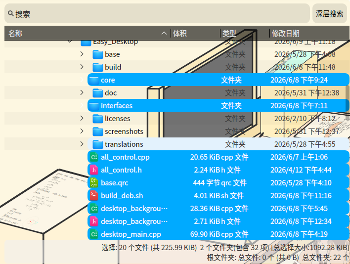
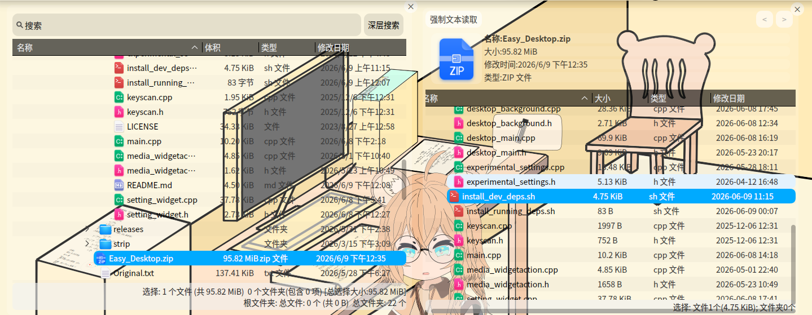
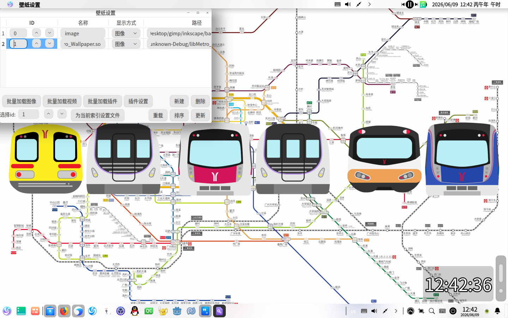

# 26.6.9更新
1.文件视图状态栏改为多行显示

2.实现压缩包(*.tar,*.zip)的预览

3.文件视图与dbus优化

4.新增壁纸插件接口

5.提供了编译脚本

6.插件更新

## 1.状态栏
因之前的单行显示需要的宽度过大,故改为多行



## 2.压缩包预览
里面用的就不是QFileSystemModel了,是使用 unzip或者tar解析压缩包的数据 解析后生成的model实现的

因为只是预览嘛,所以只留了复制文件名和设置外观的右键菜单(所以不需要像 归档管理器 那样在/tmp中解压文件)



## 3.文件视图与dbus优化

1.为了避免显示大量图片icon时卡死,改为了分区渲染

2.在save函数中记录了树状视图column的位置(column是可以拖动修改位置的)(行和列我已经分不清了,只知道column是打竖的那个)

3.修正了dbus部分add_wallpaper的逻辑,会主动更新一次壁纸列表

4.修正了My_Label的dbus的清理逻辑

## 4.插件接口

新增了一个插件接口(Ext_Wallpaper_Interface),用于实现自定义壁纸

[接口](https://github.com/3084793958/Easy_Desktop_Plugin_Interface)

壁纸插件实例:

[Metro_Wallpaper](https://github.com/3084793958/Metro_Wallpaper.git)



## 5.编译脚本

### 1.安装依赖

```
./install_dev_deps.sh
```

### 2.编译(这个过程大概要40min)

```
./build_deb.sh
```

### 3.取文件

在build/中,其中debs为*.deb输出路径,其他为各版本的编译路径

## 6.插件更新

[Window_Container](https://github.com/3084793958/Window_Container) :允许用户修改item大小

[Two_SOI_Previewer](https://github.com/3084793958/Two_SOI_Previewer.git) :新的预览插件,用于预览具有two-SOI性质的图片

[Metro_Wallpaper](https://github.com/3084793958/Metro_Wallpaper.git) :新的壁纸插件,以广州地铁为主题(前几天买了张广州地铁日票(20块钱坐全城,还送周边(日票不回收)),感觉上面的图案挺好看的,于是就做了这个)

## 还有些想不明白的问题

假设有一个场景:攻击者攻击了配置文件,植入了rm -rf的命令,或者将插件路径指向一个会破坏系统的插件,当用户触发这些命令时,就会破坏系统

怎么解决这个场景的问题

搞 白名单 或者 黑名单 是不实际的(如果用户强制要求rm -rf是要允许的)

修改时弹出弹窗询问用户对用户操作不友好(没有人希望动不动就弹出一个弹窗)

## 项目链接

项目链接:[https://github.com/3084793958/Easy_Desktop](https://github.com/3084793958/Easy_Desktop)